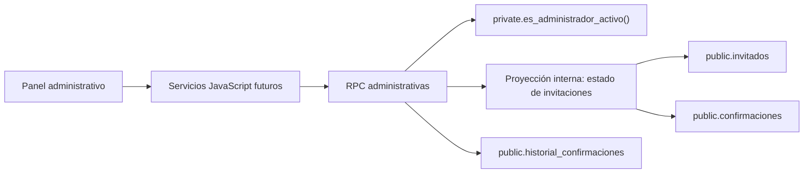
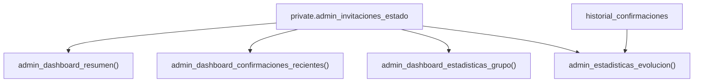

# Arquitectura de datos administrativos — Fase 3.3

## 1. Alcance y principios

Este documento define la capa de lectura administrativa que alimentará Dashboard, Invitados, Confirmaciones, Estadísticas y, en el futuro, Mesas. No contiene SQL ejecutable ni modifica la base actual.

Principios:

1. El navegador nunca consulta tablas o vistas directamente.
2. Toda lectura administrativa se realiza mediante RPC con contrato JSON versionado.
3. Las reglas de negocio se calculan en PostgreSQL, no se reconstruyen en JavaScript.
4. Las RPC comparten una representación interna del estado de cada invitación para evitar definiciones divergentes.
5. Los contratos exponen conceptos del negocio, no nombres internos de columnas.
6. Ninguna RPC de esta fase devuelve `token_acceso`.



## 2. Decisión sobre las RPC

Los cuatro nombres inicialmente sugeridos contienen una duplicidad: `admin_dashboard_resumen()` y `admin_dashboard_estadisticas_generales()` tendrían que calcular casi los mismos totales. Mantener ambas aumentaría el riesgo de que dos KPI iguales produzcan resultados diferentes.

Se propone este catálogo final:

| RPC | Responsabilidad | Consumidores futuros |
|---|---|---|
| `admin_dashboard_resumen()` | KPI globales y última actividad | Dashboard |
| `admin_dashboard_confirmaciones_recientes(p_limite integer default 10)` | Respuestas o modificaciones recientes, con límite validado entre 1 y 50 | Dashboard, Confirmaciones |
| `admin_dashboard_estadisticas_grupo()` | Desglose completo por grupo | Dashboard, Estadísticas |
| `admin_estadisticas_evolucion()` | Serie diaria de primeras respuestas y modificaciones de los últimos 30 días | Estadísticas |

`admin_dashboard_estadisticas_generales()` **no se recomienda**: sus totales se fusionan en `admin_dashboard_resumen()`. La necesidad analítica no duplicada se cubre con `admin_estadisticas_evolucion()`.

Solo la RPC de actividad reciente recibe un parámetro: `p_limite integer default 10`. El servidor rechaza valores `null`, menores que 1 o mayores que 50. La lista completa de Invitados y Confirmaciones necesitará posteriormente RPC paginadas independientes; no debe reutilizarse esta RPC limitada como listado general.

## 3. Sobre común de respuesta

Todas las RPC devolverán un único objeto `jsonb` con la misma envoltura:

```json
{
  "schema_version": "1.0",
  "generated_at": "2026-08-06T22:30:00Z",
  "data": {}
}
```

- `schema_version`: versión del contrato, no de la base de datos.
- `generated_at`: instante UTC en que PostgreSQL generó la respuesta.
- `data`: contenido específico de la RPC.

Los campos publicados en una versión no deben cambiar de tipo ni significado. Los campos nuevos se añadirán de forma compatible. Una ruptura de contrato requiere una nueva versión de RPC o `schema_version` mayor.

## 4. Definiciones funcionales

### Invitación activa

Registro de `invitados` con `activo = true`. Solo las invitaciones activas participan en KPI, porcentajes, grupos, evolución y actividad reciente.

Una invitación inactiva:

- se excluye de todos los denominadores y numeradores del Dashboard;
- no aparece en confirmaciones recientes;
- conserva su confirmación e historial en la base;
- podrá mostrarse en el futuro módulo de Invitados mediante filtros administrativos específicos.

### Confirmación o invitación con respuesta

Existe exactamente cuando la invitación activa tiene un registro vigente asociado en `confirmaciones`. Una respuesta de “no asistiré” también es una confirmación.

### Invitación pendiente

Invitación activa sin registro asociado en `confirmaciones`.

```text
pendientes = invitaciones_activas - invitaciones_con_respuesta
```

### Asistirá

Invitación activa cuya confirmación vigente tiene `estado = 'confirmado'`. El trigger actual garantiza que la suma de adultos y niños confirmados es mayor que cero.

### No asistirá

Invitación activa cuya confirmación vigente tiene `estado = 'no_asistira'`. El trigger actual asigna este estado cuando adultos y niños confirmados suman cero.

### Cupo reservado

Suma de cupos asignados a invitaciones activas, separada en adultos y niños. “Reservado” describe capacidad ofrecida, no asistencia confirmada.

### Ocupación

Proporción de personas confirmadas respecto del cupo reservado activo:

```text
total_reservado = adultos_reservados + ninos_reservados
total_confirmado = adultos_confirmados + ninos_confirmados
porcentaje_ocupacion = total_confirmado / total_reservado * 100
```

Si `total_reservado = 0`, el porcentaje es `0.00`, no `null` ni infinito.

### Porcentaje de respuesta

Proporción de invitaciones activas que ya tienen cualquier respuesta:

```text
porcentaje_respuesta = invitaciones_con_respuesta / invitaciones_activas * 100
```

Si no existen invitaciones activas, el porcentaje es `0.00`.

### Respuestas modificadas

Los KPI siempre utilizan el registro vigente de `confirmaciones`; nunca suman versiones históricas. `fecha_confirmacion` representa la primera respuesta y `fecha_actualizacion` la última modificación. El historial se usa únicamente para auditoría y evolución de actividad.

### Confirmación reciente y última confirmación

La fecha de actividad de una confirmación es `fecha_actualizacion`, que en una creación coincide inicialmente con `fecha_confirmacion`. “Última confirmación” significa la última actividad vigente —creación o modificación— entre invitaciones activas.

### Tiempo promedio de respuesta

No es posible calcularlo con precisión actualmente. `invitados.fecha_creacion` indica cuándo se creó el registro, no cuándo se envió la invitación. Usarlo produciría una métrica semánticamente falsa.

El contrato devuelve explícitamente:

```json
{
  "tiempo_promedio_respuesta_horas": null,
  "tiempo_promedio_disponible": false,
  "motivo_no_disponible": "No existe fecha de envío de la invitación."
}
```

Para habilitarlo en el futuro se requerirá una marca confiable como `fecha_envio` o un historial de envíos. Ese cambio queda fuera de esta fase.

## 5. Catálogo exacto de métricas

| Métrica | Cálculo sobre invitaciones activas |
|---|---|
| Invitaciones activas | Conteo de invitaciones activas |
| Con respuesta | Conteo con confirmación vigente |
| Pendientes | Activas menos con respuesta |
| Asistirán | Confirmación vigente `confirmado` |
| No asistirán | Confirmación vigente `no_asistira` |
| Adultos reservados | Suma de `adultos_asignados` |
| Niños reservados | Suma de `ninos_asignados` |
| Adultos confirmados | Suma vigente de adultos confirmados; pendiente equivale a cero |
| Niños confirmados | Suma vigente de niños confirmados; pendiente equivale a cero |
| Total confirmado | Adultos confirmados más niños confirmados |
| Porcentaje de respuesta | Con respuesta / activas × 100 |
| Porcentaje de ocupación | Total confirmado / total reservado × 100 |
| Confirmaciones recientes | Máximo 10 registros por actividad descendente |
| Última confirmación | Máxima fecha de actividad vigente |
| Tiempo promedio | No disponible hasta registrar el envío |

Los porcentajes se entregan como números JSON redondeados a dos decimales y siempre dentro de `0.00–100.00`, suponiendo que se mantienen las restricciones actuales de cupo.

## 6. Contratos JSON

### 6.1 `admin_dashboard_resumen()`

Realiza una sola agregación global sobre la proyección común de invitaciones activas.

```json
{
  "schema_version": "1.0",
  "generated_at": "2026-08-06T22:30:00Z",
  "data": {
    "invitaciones": {
      "activas": 92,
      "con_respuesta": 28,
      "pendientes": 64,
      "asistiran": 24,
      "no_asistiran": 4
    },
    "cupo": {
      "adultos_reservados": 190,
      "ninos_reservados": 35,
      "total_reservado": 225
    },
    "asistencia": {
      "adultos_confirmados": 48,
      "ninos_confirmados": 9,
      "total_confirmado": 57
    },
    "porcentajes": {
      "respuesta": 30.43,
      "ocupacion": 25.33
    },
    "actividad": {
      "ultima_confirmacion_at": "2026-08-06T22:10:00Z",
      "tiempo_promedio_respuesta_horas": null,
      "tiempo_promedio_disponible": false,
      "motivo_no_disponible": "No existe fecha de envío de la invitación."
    }
  }
}
```

Cuando no existe actividad, `ultima_confirmacion_at` es `null`.

### 6.2 `admin_dashboard_confirmaciones_recientes(p_limite integer default 10)`

Devuelve las actividades vigentes más recientes. El valor predeterminado es 10; el servidor acepta entre 1 y 50. Un valor `null`, menor que 1 o mayor que 50 produce un error de argumento y no se normaliza silenciosamente. No devuelve mensaje, teléfono, notas ni token.

```json
{
  "schema_version": "1.0",
  "generated_at": "2026-08-06T22:30:00Z",
  "data": {
    "items": [
      {
        "invitacion_id": 1,
        "codigo": "JM-FM-001",
        "nombre": "Tía Hili",
        "grupo": "Familia Marcos",
        "estado": "confirmado",
        "adultos_confirmados": 2,
        "ninos_confirmados": 0,
        "total_confirmado": 2,
        "fecha_primera_respuesta": "2026-08-05T18:00:00Z",
        "fecha_ultima_actividad": "2026-08-06T22:10:00Z",
        "es_actualizacion": true
      }
    ],
    "meta": {
        "limite": 10,
      "cantidad": 1
    }
  }
}
```

`es_actualizacion` es verdadero cuando el historial contiene al menos una acción `actualizada` para la invitación. No se infiere únicamente comparando fechas, porque dos operaciones dentro de la misma transacción podrían compartir timestamp. El desempate de orden debe ser estable: fecha de actividad descendente e identificador descendente.

Ejemplos de validación del parámetro:

| Entrada | Resultado esperado |
|---|---|
| Sin argumento | 10 elementos como máximo |
| `1` | 1 elemento como máximo |
| `50` | 50 elementos como máximo |
| `0`, `51` o `null` | Error `22023` |

### 6.3 `admin_dashboard_estadisticas_grupo()`

Devuelve un elemento por grupo con las mismas reglas globales. No repite un total general; el consumidor usa `admin_dashboard_resumen()` para ello.

```json
{
  "schema_version": "1.0",
  "generated_at": "2026-08-06T22:30:00Z",
  "data": {
    "items": [
      {
        "grupo": "Familia Marcos",
        "invitaciones": {
          "activas": 43,
          "con_respuesta": 15,
          "pendientes": 28,
          "asistiran": 13,
          "no_asistiran": 2
        },
        "cupo": {
          "adultos_reservados": 95,
          "ninos_reservados": 20,
          "total_reservado": 115
        },
        "asistencia": {
          "adultos_confirmados": 28,
          "ninos_confirmados": 5,
          "total_confirmado": 33
        },
        "porcentajes": {
          "respuesta": 34.88,
          "ocupacion": 28.70
        }
      }
    ]
  }
}
```

El orden se define por el orden de negocio actual: `Familia Marcos`, `Familia Jess`, `Amigos Marcos`, `Amigos Jess`; cualquier grupo futuro se agrega después en orden alfabético. El contrato no presupone que siempre existirán exactamente cuatro grupos.

### 6.4 `admin_estadisticas_evolucion()`

Sustituye la RPC redundante `admin_dashboard_estadisticas_generales()`. Entrega una serie diaria limitada a los últimos 30 días naturales en la zona `America/Mexico_City`.

La respuesta separa dos conceptos que no deben mezclarse:

- **Actividad del día:** eventos que ocurrieron durante esa fecha. `primeras_respuestas` cuenta creaciones y `modificaciones` cuenta cambios posteriores. Estos valores pueden ser cero.
- **Estado acumulado al cierre:** última versión conocida de cada confirmación al terminar ese día. Representa cuántas invitaciones asistían o no asistían y cuántas personas estaban confirmadas hasta ese momento. No es la suma de la actividad diaria.

La RPC genera una serie continua con los 30 días del periodo en orden ascendente. Los días sin actividad también se devuelven: su actividad contiene ceros y su estado al cierre conserva el último estado acumulado disponible hasta ese día. Antes de la primera respuesta, todos los valores acumulados son cero.

```json
{
  "schema_version": "1.0",
  "generated_at": "2026-08-06T22:30:00Z",
  "data": {
    "periodo": {
      "desde": "2026-07-08",
      "hasta": "2026-08-06",
      "dias": 30,
      "zona_horaria": "America/Mexico_City"
    },
    "items": [
      {
        "fecha": "2026-08-06",
        "actividad": {
          "primeras_respuestas": 3,
          "modificaciones": 2
        },
        "estado_al_cierre": {
          "invitaciones_asisten": 24,
          "invitaciones_no_asisten": 4,
          "adultos_confirmados": 48,
          "ninos_confirmados": 9,
          "asistentes_confirmados": 57
        }
      }
    ]
  }
}
```

“Al cierre” se reconstruye tomando, para cada invitación activa, el último registro de historial existente antes del inicio del día siguiente en `America/Mexico_City`. Las modificaciones reemplazan el estado anterior: no se suman como nuevas invitaciones. Esta reconstrucción es la consulta más costosa y deberá validarse con `EXPLAIN (ANALYZE, BUFFERS)` antes de considerar ventanas mayores.

## 7. Proyección interna compartida

Se propone que `05_admin_dashboard.sql` defina una vista interna, no accesible desde el navegador, similar conceptualmente a `private.admin_invitaciones_estado`. Centralizará:

- identificador administrativo;
- código, nombre y grupo;
- cupos reservados;
- existencia de respuesta;
- estado vigente;
- cantidades confirmadas normalizadas a cero;
- primera respuesta;
- última actividad.

La vista filtrará `activo = true`. Las RPC de resumen, recientes y grupos leerán esa misma definición. La vista estará dentro del esquema `private`, cuyo acceso ya está revocado para `public`, `anon` y `authenticated`.



La vista es una implementación interna, no parte del contrato. Puede reemplazarse más adelante sin afectar al frontend.

## 8. Seguridad obligatoria

Cada RPC deberá:

- usar `SECURITY DEFINER`;
- establecer `search_path = ''`;
- comenzar validando `private.es_administrador_activo()`;
- fallar con un error administrativo genérico cuando no exista autorización;
- usar nombres de objetos totalmente calificados;
- devolver únicamente el contrato documentado;
- no devolver `token_acceso`, mensaje, teléfono o notas;
- revocar `EXECUTE` a `PUBLIC` y `anon`;
- conceder `EXECUTE` únicamente a `authenticated`.

Las vistas internas y funciones auxiliares no recibirán permisos para `authenticated`. No se crearán políticas que permitan seleccionar tablas directamente.

Para evitar enumeración de datos, una sesión no autorizada no recibe un JSON vacío: la RPC debe rechazar la operación. `admin_verificar_acceso()` conserva su comportamiento actual y sigue siendo la comprobación inicial del frontend.

## 9. Rendimiento e índices

### Estado actual

- `confirmaciones.invitado_id` es clave primaria y soporta eficientemente el `LEFT JOIN`.
- Existen índices separados sobre `invitados.activo` e `invitados.grupo`.
- Existe índice descendente sobre `historial_confirmaciones.fecha_evento`.
- Con 92 invitaciones, todas las agregaciones son pequeñas.

### Recomendaciones para cientos o miles de registros

1. Evaluar un índice de actividad reciente:

   ```text
   confirmaciones (fecha_actualizacion DESC, invitado_id)
   ```

2. Evaluar un índice parcial para agrupaciones activas:

   ```text
   invitados (grupo) WHERE activo = true
   ```

3. Para evolución por historial, evaluar:

   ```text
   historial_confirmaciones (fecha_evento DESC, accion, invitado_id)
   ```

Estos índices son propuestas, no requisitos inmediatos. Antes de incluirlos se debe ejecutar `EXPLAIN (ANALYZE, BUFFERS)` con volumen representativo. El bajo número actual de filas puede hacer que PostgreSQL prefiera correctamente un recorrido secuencial.

### Vista normal vs. materializada

La proyección común debe comenzar como vista normal interna:

- los datos cambian con cada RSVP;
- el volumen es pequeño;
- el Dashboard debe reflejar cambios inmediatamente;
- una vista materializada introduciría refrescos y estados obsoletos.

Una vista materializada solo tendría sentido con decenas de miles de invitaciones o reconstrucciones históricas costosas. No se recomienda ahora.

### Crecimiento de consultas

- Resumen y grupos crecen linealmente con invitaciones activas.
- Recientes se beneficia del índice por fecha y permanece limitada a 10 elementos.
- Evolución es la consulta de mayor riesgo porque combina historial y serie temporal.
- Los futuros listados de Invitados y Confirmaciones deben usar paginación por cursor; no deben devolver todas las filas en un único JSON.

## 10. Riesgos

| Riesgo | Mitigación propuesta |
|---|---|
| Definiciones duplicadas entre RPC | Vista interna común y documento funcional único |
| Frontend acoplado a columnas | Contratos JSON versionados |
| Porcentajes divergentes | Cálculo exclusivo en PostgreSQL y redondeo uniforme |
| Inactivos alteran KPI | Filtro obligatorio en la proyección base |
| Modificaciones contadas como nuevas respuestas | Separar primera respuesta de última actividad |
| Tiempo de respuesta engañoso | Mantener métrica indisponible hasta registrar envío |
| Exposición accidental de tokens | Ningún contrato de Dashboard incluye `token_acceso` |
| RPC ejecutable por usuarios no autorizados | Permiso `authenticated` más validación interna de administrador |
| Serie histórica costosa | Ventana de 30 días, pruebas de plan y simplificación inicial posible |
| Diferencias de fecha por zona horaria | Zona explícita `America/Mexico_City` |

## 11. Plan de implementación posterior

Después de aprobar métricas, nombres y contratos:

1. Crear `database/05_admin_dashboard.sql` idempotente.
2. Crear la vista interna compartida en `private`.
3. Implementar `admin_dashboard_resumen()` y pruebas positivas/negativas.
4. Implementar confirmaciones recientes con límite predeterminado 10, validación `1–50` y orden estable.
5. Implementar estadísticas por grupo y validar que su suma coincida con el resumen.
6. Implementar evolución con actividad diaria y estado acumulado al cierre; validar su reconstrucción histórica con `EXPLAIN`.
7. Aplicar revocaciones y concesiones explícitas.
8. Probar administrador activo, inactivo, autenticado no autorizado y anónimo.
9. Verificar que ninguna RPC pública del RSVP cambió.
10. Ejecutar consultas de invariantes:
    - activas = con respuesta + pendientes;
    - con respuesta = asistirán + no asistirán;
    - total reservado = adultos + niños reservados;
    - total confirmado = adultos + niños confirmados;
    - sumas por grupo = resumen global.

No se implementará JavaScript ni interfaz hasta que la capa SQL y sus contratos estén aprobados, ejecutados y validados.

## 12. Decisiones que requieren aprobación

1. Fusionar `admin_dashboard_estadisticas_generales()` dentro de `admin_dashboard_resumen()`.
2. Crear en su lugar `admin_estadisticas_evolucion()` con ventana fija de 30 días.
3. Excluir completamente invitaciones inactivas de KPI y actividad reciente.
4. Interpretar “última confirmación” como última creación o modificación vigente.
5. Mantener el tiempo promedio como no disponible hasta registrar una fecha real de envío.
6. Usar `America/Mexico_City` para agregaciones diarias.
7. Usar límite predeterminado 10 y permitir `p_limite` únicamente entre 1 y 50.

## 13. Plan de pruebas para `05_admin_dashboard.sql`

Estas pruebas se ejecutarán manualmente después de aprobar el script. Ninguna se ha ejecutado durante el diseño.

### 13.1 Instalación e idempotencia

1. Ejecutar el script completo una vez y confirmar `Success`.
2. Ejecutarlo una segunda vez y confirmar que no falla ni duplica objetos.
3. Verificar que las RPC públicas `obtener_invitacion(uuid)` y `guardar_confirmacion(uuid, smallint, smallint, text)` conservan firmas y permisos.

### 13.2 Permisos

```sql
select
    has_function_privilege(
        'anon',
        'public.admin_dashboard_resumen()',
        'execute'
    ) as anon_resumen,
    has_function_privilege(
        'authenticated',
        'public.admin_dashboard_resumen()',
        'execute'
    ) as authenticated_resumen,
    has_table_privilege(
        'authenticated',
        'private.admin_invitaciones_estado',
        'select'
    ) as authenticated_vista;
```

Resultado esperado: `false`, `true`, `false`.

Repetir `has_function_privilege` para las otras tres firmas, incluyendo `public.admin_dashboard_confirmaciones_recientes(integer)`.

### 13.3 Usuario autenticado no autorizado

```sql
begin;
set local role authenticated;
set local request.jwt.claims =
    '{"sub":"00000000-0000-4000-8000-000000000001","role":"authenticated"}';

select public.admin_dashboard_resumen();
rollback;
```

Resultado esperado: error `42501`, sin datos parciales.

### 13.4 Administrador activo

Usar el UUID Auth real de un administrador activo:

```sql
begin;
set local role authenticated;
set local request.jwt.claims =
    '{"sub":"<UUID_ADMIN_ACTIVO>","role":"authenticated"}';

select public.admin_dashboard_resumen();
select public.admin_dashboard_confirmaciones_recientes();
select public.admin_dashboard_confirmaciones_recientes(50);
select public.admin_dashboard_estadisticas_grupo();
select public.admin_estadisticas_evolucion();
rollback;
```

Las cinco llamadas deben respetar la envoltura `schema_version`, `generated_at` y `data`.

### 13.5 Validación de `p_limite`

Con contexto de administrador activo:

```sql
select public.admin_dashboard_confirmaciones_recientes(1);
select public.admin_dashboard_confirmaciones_recientes(50);
select public.admin_dashboard_confirmaciones_recientes(0);
select public.admin_dashboard_confirmaciones_recientes(51);
select public.admin_dashboard_confirmaciones_recientes(null);
```

Los dos primeros valores son válidos. Los tres últimos deben fallar con `22023`.

### 13.6 Invariantes del resumen

Validar sobre el JSON retornado:

- `activas = con_respuesta + pendientes`;
- `con_respuesta = asistiran + no_asistiran`;
- `total_reservado = adultos_reservados + ninos_reservados`;
- `total_confirmado = adultos_confirmados + ninos_confirmados`;
- porcentajes entre 0 y 100;
- sumas de todos los grupos iguales al resumen global.

Comparar adicionalmente los resultados contra consultas manuales ejecutadas como `postgres`, sin conceder esos accesos al frontend.

### 13.7 Evolución

```sql
select jsonb_array_length(
    public.admin_estadisticas_evolucion()
        -> 'data' -> 'items'
) as dias;
```

Resultado esperado: exactamente `30`.

Comprobar además:

- fechas consecutivas en orden ascendente;
- primer día igual a `hasta - 29`;
- días sin eventos presentes con actividad en cero;
- estado acumulado conservado durante días sin actividad;
- una modificación cambia el estado al cierre sin aumentar `primeras_respuestas`;
- todos los cortes diarios usan `America/Mexico_City`.

### 13.8 Rendimiento

Ejecutar `EXPLAIN (ANALYZE, BUFFERS)` sobre cada RPC con datos representativos. La atención principal será `admin_estadisticas_evolucion()`. No se aprobará una ventana mayor hasta revisar su plan y tiempo de ejecución.
